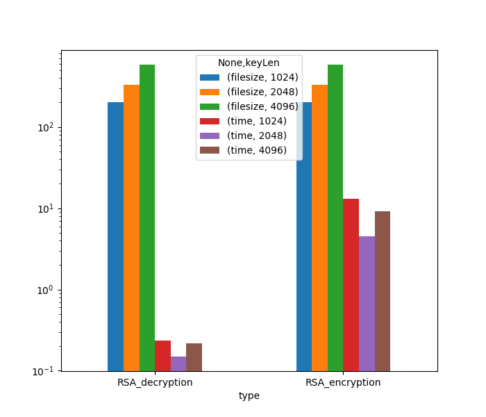
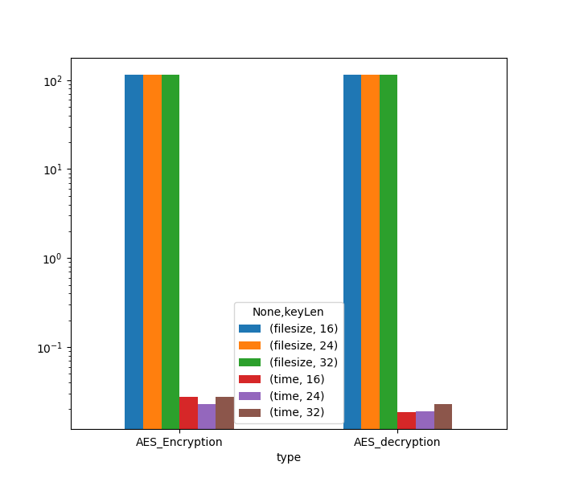

# Lab 4 Observation Report
For both `AES` and `RSA` we use the same sample text (`It's over Anakin! I have the high ground!`) for encryption and we record the execution time, ciphertext size for different keys during both encryption and decryption. Visulization was done in `base-10 logarithmic scale` on the Y-axis.
Both the algorithms were emulated through the `PyCryptodome` library.

## `RSA`
The time algorithmic complexity of RSA is O(n^2). It is observed that as the size of private key length increases, the increase in time becomes nonlinear and exponential.

Here, we successively tried the keylengths
[1024, 2048, 4096] as per the instructions.

From our primary observations we see that :
* Encryption takes several multitudes more time than decryption.
* The size of ciphertext increases with the increase of `KeyLength`
* The time consumption follows similar trend for both encryption and decryption
* The execution time seems arbitrary for both encryption and decryption
## AES
Considering that this algorithm is operating on a fixed block size, and each block will take the same amount of time regardless of the input, the time complexity of this algorithm is only O(1).

Here, we successively tried the keylengths
[128, 192, 256] as per the instructions.

From our primary observations we see that :
* The generated ciphertext has the same size regardless of the keylength, as is expected.
* The encryption decryption method does not follow the same trend.
* The execution time seems arbitrary for both encryption and decryption
## Source :
[Algohub](algohub.me)