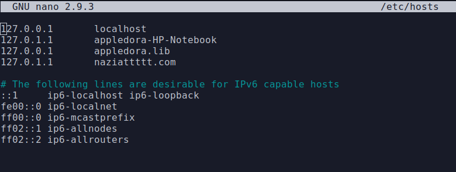

# Task 1 Checkpoint 1

1. Install Apache

```text
sudo apt update
sudo apt install apache2
```


2. Adjusting Firewall

Check existing firewall profiles and enable "Apache" firewall


3. Check the status of the apache server if it is running or not.


Map `localhost` to `appledora.lib` __by editing the `/etc/hosts` file



By visiting `appledora.lib` __the default apache webpage can be found.


