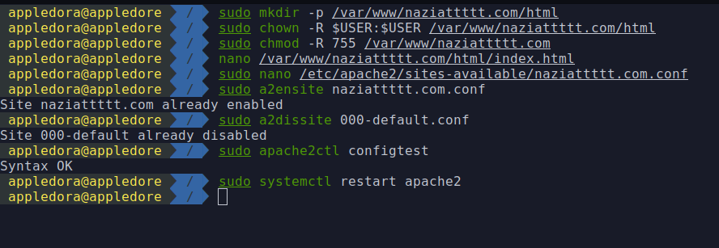
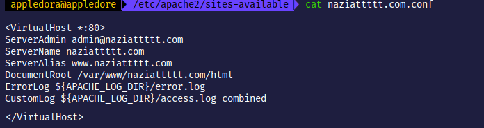
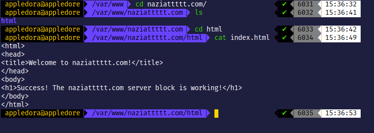
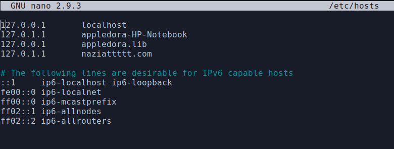

# Task 1 Checkpoint 2

We need to create a new virtual host to deploy a new domain from our webserver. For our purposes, we create `naziattttt.com` as the new domain.

Configuration file for the domain

Default index.html for the new domain

The new domain will not directly work because it is not a registered domain. To direct traffic to this url we need to assign an ip address to the domain by mapping an ip address in our `/etc/hosts` file. After that restart the apache server

Visiting the link `naziattttt.com` the following page shows up:

