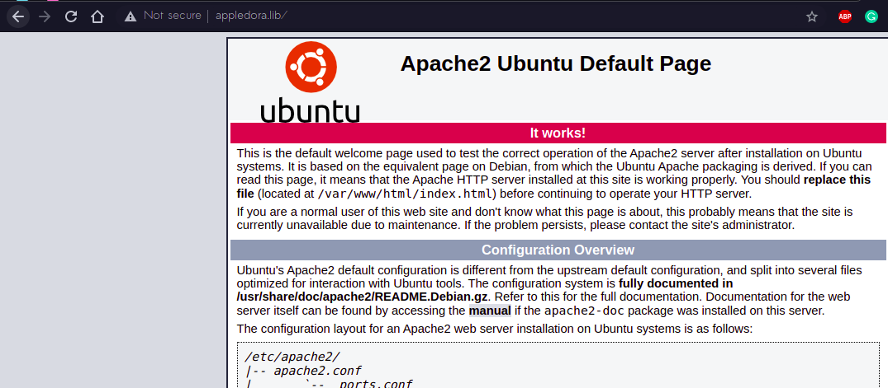
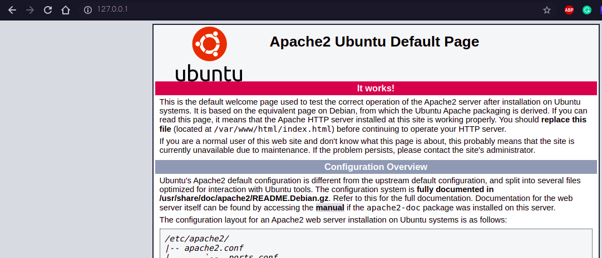

# Task 1 Checkpoint 3

After running the following command,

```text
sudo a2ensite 000-default.conf
sudo systemctl restart apache2
```

When we visit `appledora.lib` or `127.0.0.1` it serves the default apache page.





This is happening because each url or domain has its own configuration. We set up different virtual hosts which run in their own containers. So, our apache server is hosting both domains independently. 

