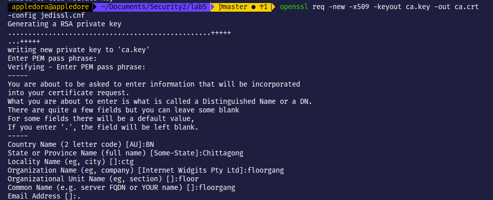
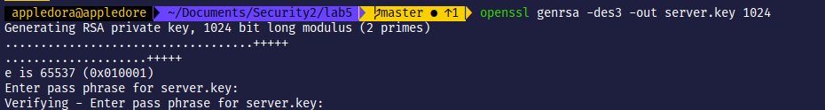
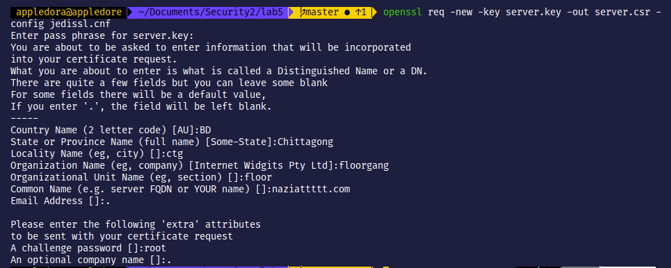
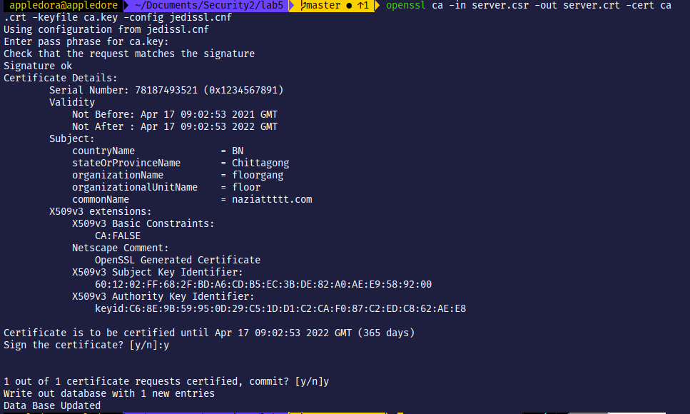
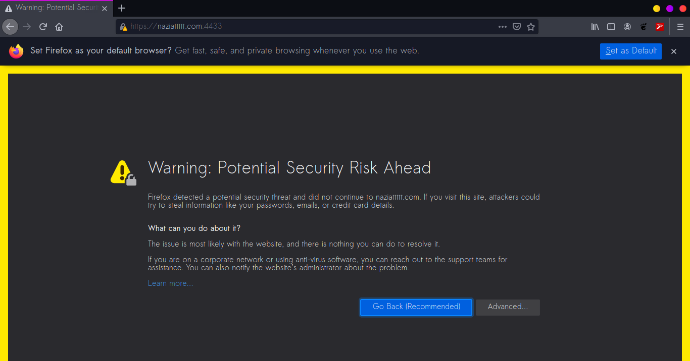
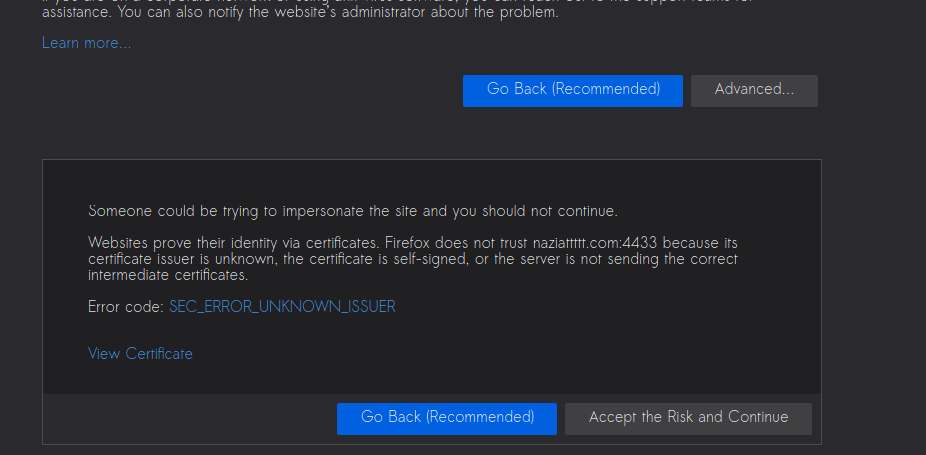

# Task 2 Checkpoint 4

First we copy `/usr/lib/ssl/openssl.cnf` in our working directory as `jedissl.cnf`. We also created the required subdirectories inside `./jediCA`

We run the following command by passing in our `jedissl.cnf` to generate the self-signed certificate:



#### Generating certificate for naziattttt.com

Now we follow the 3 steps to generate a certificate for `naziattttt.com`







#### Using OpenSSL to demonstrate HTTPS

We run the following code to combine the certificate and key files and then launch the server using the certificate.

```text
cp server.key server.pem
cat server.crt >> server.pem
openssl s_server -cert server.pem -www
```

When we visit `https://naziattttt.com:4433` the following error is shown in mozilla. This is certificate issuer not found error.





\_\_

