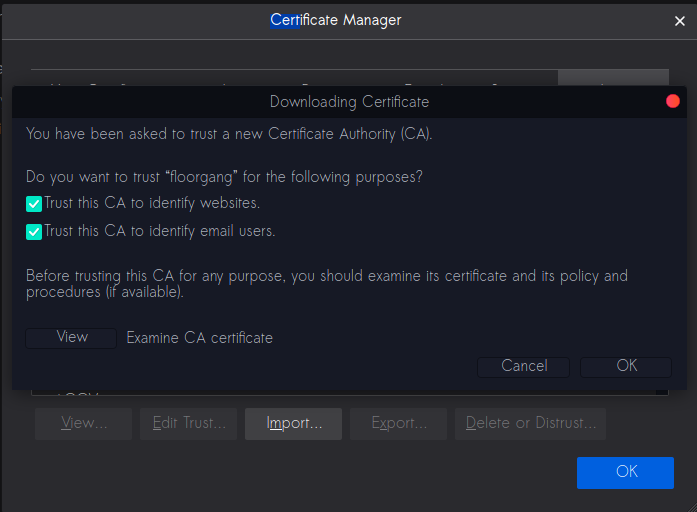
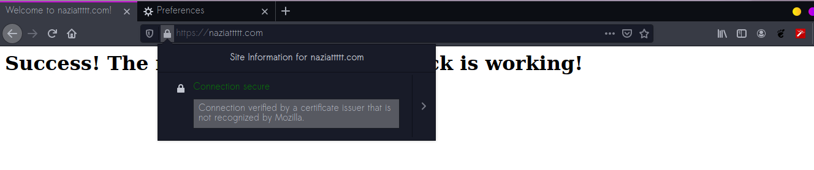

# Task 3 Checkpoint 5

We update the configuration file at `etc/apache2/sites-available/naziattttt.com.conf`  by adding the provided content.

Next, we import the certificate into mozilla.

Finally, when we visit `https://naziattttt.com` we can see the HTTPS secured tag.

