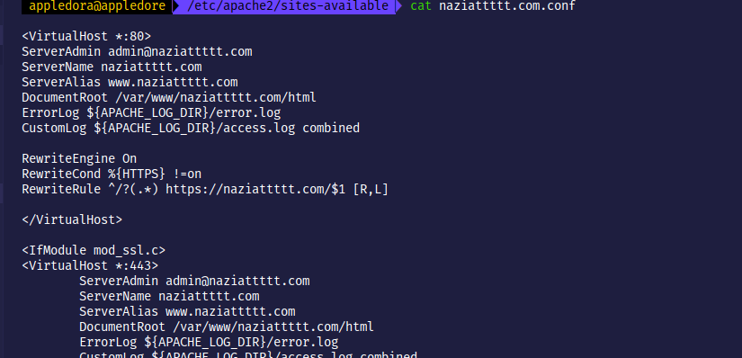

# Task 4 Checkpoint 6

To ensure the webserver always uses HTTPS, we will redirect the `http://naziattttt.com` to `https://naziattttt.com`. We add the following lines to the configuration file at `/etc/apache2/sites-available/naziattttt.com.conf`

After restarting the apache server, the http link successfully redirects to https.

